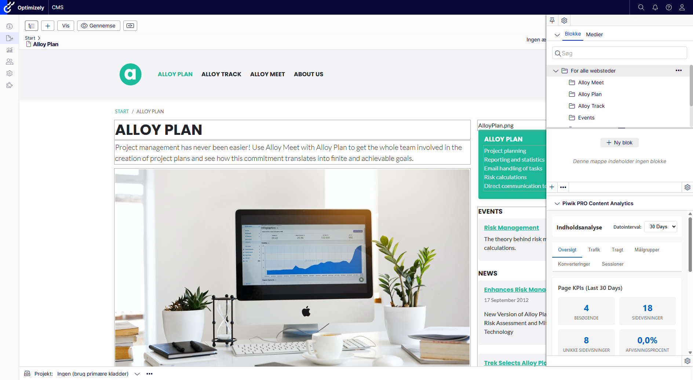

# Content Analytics Widget

The Content Analytics Widget appears in the CMS assets pane (right-hand side) when you are editing content. It provides per-page analytics directly inside the Optimizely editor, so content authors can see how their pages perform without leaving the CMS.

## Tabs

The widget organizes analytics into six tabs:

| Tab | Description |
|-----|-------------|
| **Overview** | Key performance indicators for the page -- unique visitors, page views, bounce rate, average time on page, and exit rate -- together with a daily traffic chart. |
| **Traffic** | Traffic source breakdown showing how visitors arrived at this page (direct, search, referral, campaigns, social). |
| **Funnel** | Navigation flow for the page: previous pages (where visitors came from), next pages (where they went), and outlinks (external URLs they clicked). |
| **Audiences** | Visitor group breakdown for the page. This tab is populated only when audience tracking is enabled (`TrackAudiencesAsEvents` and `AudienceDimensionId` configured). |
| **Conversions** | Goal conversions attributed to this page, plus a per-page goal picker that lets editors assign a goal to the page. |
| **Sessions** | Session logs for visitors who viewed this content, showing individual visit details. |

## Block and Non-Page Content

When you select a block or other non-page content in the editor, the widget automatically aggregates analytics across every page that references that content. References are resolved through Optimizely's `IContentSoftLinkRepository`, so any page that includes the block in a content area or property will contribute its analytics to the totals.

If a block has no referencing pages, the widget displays a message indicating that no analytics are available.

## Per-Page Goal Tracking

Editors can assign a Piwik PRO goal to any page directly from the Conversions tab:

1. Open the content in the Optimizely editor.
2. In the assets pane, open the Piwik PRO Content Analytics widget.
3. Switch to the **Conversions** tab.
4. Select a goal from the dropdown list. The dropdown is populated from the goals configured in your Piwik PRO app.
5. Click **Save**.

Once saved, the selected goal fires automatically on every front-end view of that page. This lets editors tie specific conversion goals to individual pieces of content without developer involvement.

To remove a goal assignment, open the Conversions tab and click **Remove**. The goal will no longer fire on page views.

## Requirements

- The page must be published for analytics data to be available.
- The Piwik PRO connector must be fully configured (BaseUrl, WebSiteId, and valid credentials).
- For audience data, `TrackAudiencesAsEvents` must be set to `true` and `AudienceDimensionId` must be configured.
