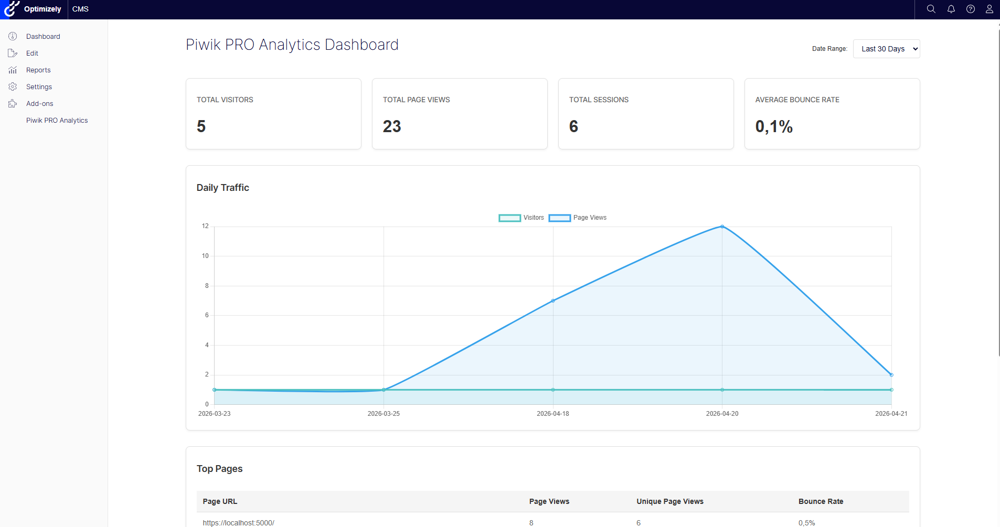
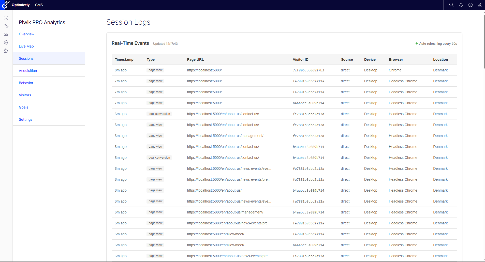
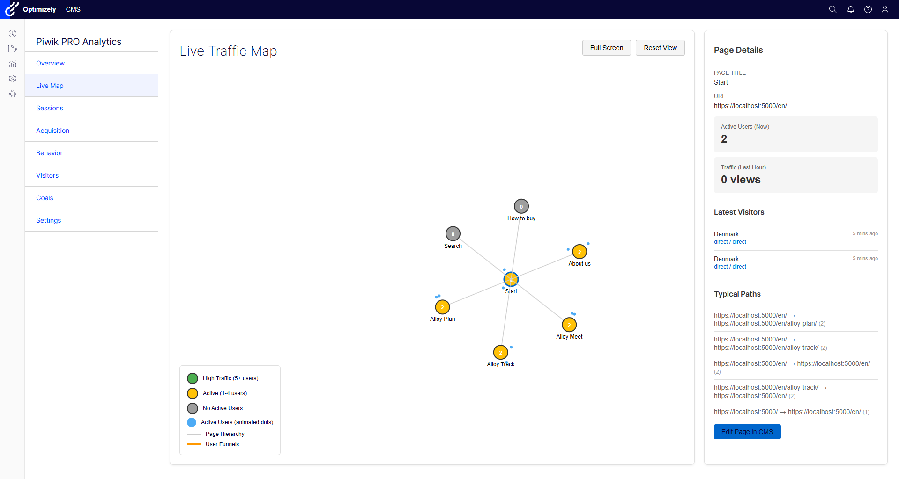
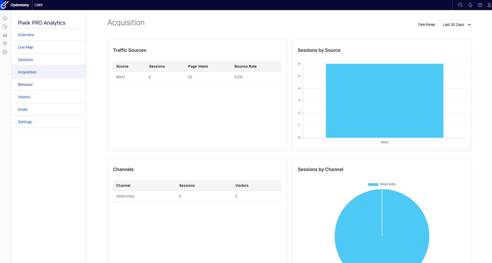
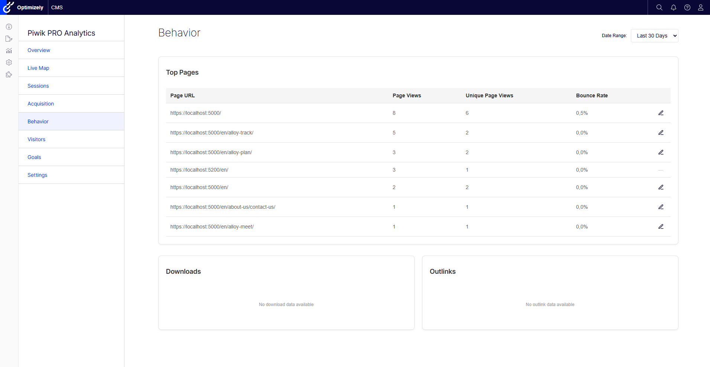
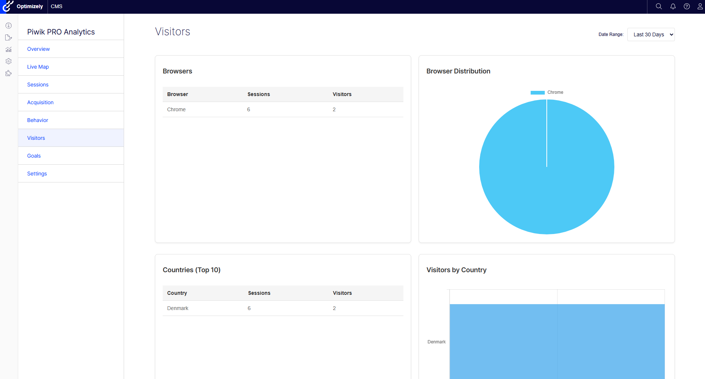
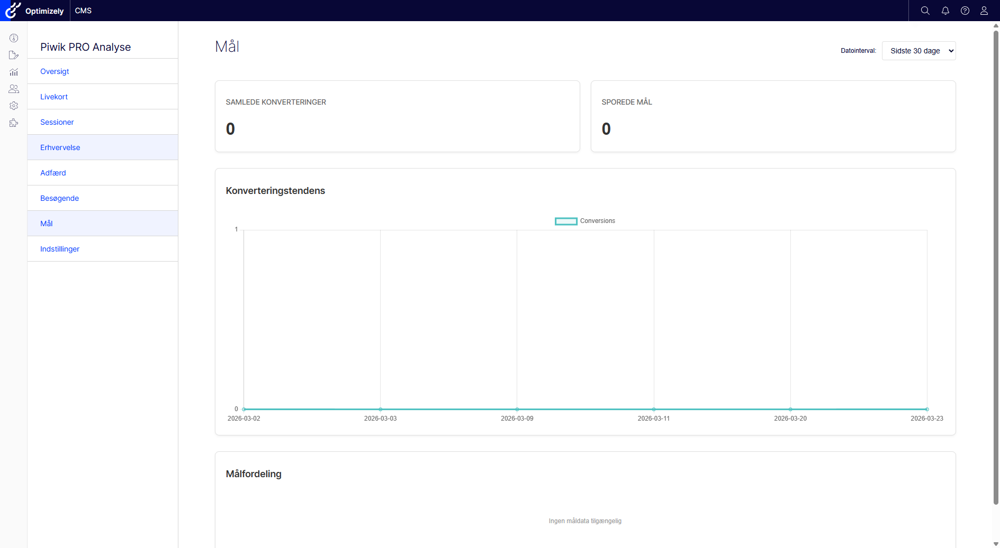
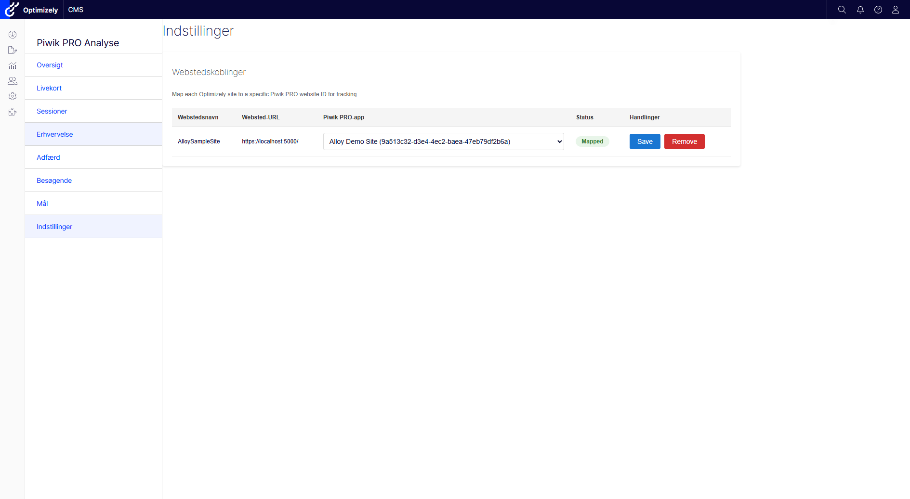

# Analytics Dashboard

The Piwik PRO analytics dashboard is built into the Optimizely CMS admin interface. Access it from the CMS top navigation under **Piwik PRO Analytics**. The dashboard provides eight tabs covering traffic overview, session logs, live visualization, acquisition channels, behavior metrics, visitor demographics, goal tracking, and site configuration.

All dashboard tabs share a date range selector (7, 14, 30, 60, or 90 days) that is persisted per user, so your preferred time window is remembered across sessions.

> The dashboard requires the `piwikpro:admin` authorization policy (defaults to the WebAdmins role). You must have a valid Piwik PRO configuration (BaseUrl, WebSiteId, and either an AccessToken or ClientId + ClientSecret) before any data will appear.

## Overview

The Overview tab is the default landing page and provides a high-level summary of site traffic.

- **Metric cards** -- Total Visitors, Page Views, Sessions, and Bounce Rate for the selected date range.
- **Daily traffic line chart** -- A Chart.js line chart plotting visitors and page views over time, one data point per day.
- **Top pages table** -- Lists the most-visited pages with columns for URL, Page Views, Unique Page Views, and Bounce Rate.
- **Configuration info box** -- Displays the current Piwik PRO connection details (base URL, website ID) so you can confirm the dashboard is pointing at the correct app.

## Sessions

The Sessions tab shows individual visitor sessions and real-time event activity.

- **Real-time events table** -- Auto-refreshes every 30 seconds to show the latest incoming events.
- **Session logs table** -- A paginated table of recent sessions with the following columns:
  - Timestamp
  - Visitor ID
  - Source
  - Medium
  - Device
  - Browser
  - Operating System
  - Country
  - City
  - Campaign

## Live Map

The Live Map tab provides an interactive, real-time visualization of how users navigate your site.

- **D3.js force-directed graph** -- Pages are represented as nodes connected by navigation paths.
- **Node colors indicate activity level:**
  - Green -- 5 or more active users on the page
  - Amber -- 1 to 4 active users
  - Grey -- no active users
- **Orbiting dots** -- Individual active users are shown as small dots orbiting around page nodes.
- **Interaction:**
  - Double-click a node to expand or collapse its child pages.
  - Click a node to view page details, latest visitors, and navigation paths.
  - Funnel lines show common navigation patterns between pages.
- **Fullscreen mode** and zoom/pan support for exploring large site hierarchies.
- **Simulated data mode** -- Enable the `UseSimulatedLiveMapData` configuration option to populate the map with sample data for demos and testing.

## Acquisition

The Acquisition tab breaks down where your traffic is coming from.

- **Traffic sources** -- A table and bar chart showing the volume of traffic from each source (e.g., direct, referral, search engine).
- **Channels** -- A table and pie chart categorizing traffic by marketing channel.

## Behavior

The Behavior tab focuses on what visitors do on your site.

- **Top pages table** -- Pages ranked by Page Views, with additional columns for Unique Page Views and Bounce Rate.
- **Downloads table** -- Files downloaded by visitors, with download counts.
- **Outlinks table** -- External links clicked by visitors, showing the destination URL and click count.

## Visitors

The Visitors tab provides demographic and technical breakdowns of your audience.

- **Browsers** -- A table and pie chart showing the distribution of browsers used by visitors.
- **Countries** -- A table and horizontal bar chart displaying the top 10 countries by visitor count.
- **Session duration distribution** -- A bar chart showing how long sessions last, grouped into duration buckets.

## Goals

The Goals tab tracks conversions configured in your Piwik PRO app.

- **Summary metric cards** -- Total Conversions and Tracked Goals count for the selected date range.
- **Conversion trend line chart** -- A daily line chart showing conversion volume over time.
- **Goal breakdown table** -- Each tracked goal listed with its individual conversion count and details.

## Settings

The Settings tab manages the mapping between Optimizely sites and Piwik PRO apps. This is essential for multi-site Optimizely installations where each site reports to a different Piwik PRO app.

- **Site-to-app mapping table** -- Lists every Optimizely site with a dropdown selector to associate it with a Piwik PRO app (website ID).
- Mappings are stored in Optimizely's Dynamic Data Store (DDS) and take effect immediately.
- When a visitor browses a particular Optimizely site, the connector uses the mapped website ID for all tracking and analytics queries.
